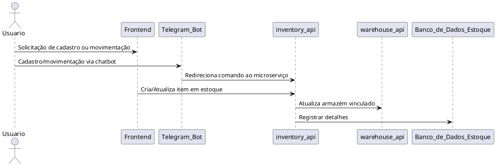
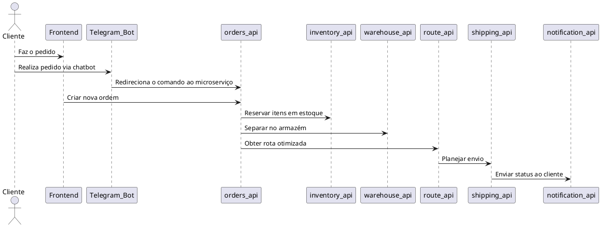

# Arquitetura Completa de Logística

Este documento descreve a nova arquitetura desenhada para transformar a solução AppDelivery em um sistema completo para gerenciamento de logística, atendimento multi-clientes e gerenciamento de ordens.

## Novos Microserviços

| Microserviço        | Responsabilidade                                                                                  |
|---------------------|--------------------------------------------------------------------------------------------------|
| **auth_api**        | Controla autenticação e perfis de usuários (já existente)                                        |
| **orders_api**      | Gerencia pedidos (atualização para movimentação logística)                                        |
| **delivery_api**    | Opera entrega de produtos aos destinatários (renomear para shipping)                             |
| **inventory_api**   | CRUD de produtos e controle de estoque nos armazéns                                              |
| **warehouse_api**   | Cadastro e gerenciamento de múltiplos armazéns                                                   |
| **shipping_api**    | Gera ordem de envios para transportadoras                                                        |
| **route_api**       | Cálculo e otimização de rotas, integração com Google Maps                                        |
| **billing_api**     | Gerenciamento de faturas, pagamentos e splits                                                   |
| **vendor_api**      | Cadastro de fornecedores e integração B2B                                                        |
| **analytics_api**   | Relatórios e dashboards logísticos                                                               |
| **notification_api**| Envio de notificações centralizadas                                                              |

## Esqueleto docker-compose Expandido
```yaml
services:
  # Existentes
  api-gateway:
    build:
      context: ./api-gateway
...
```

## Integração com APIs Externas
- **Google Maps:** Rotas e localização
- **APIs de Transportadoras:** Para rastreio de entregas
- **Pagamentos:** Para gerenciar cobranças e faturas via gateways como Stripe/Mercado Pago.

---

## Fluxos de Estoque e Pedidos com Telegram

### Cadastro e Movimentação de Estoque


### Criação de Pedido e Estoque Integrando Telegram


Use uma ferramenta como [PlantUML](https://plantuml.com/) ou [PlantText](https://www.planttext.com/) para visualizar os diagramas acima.